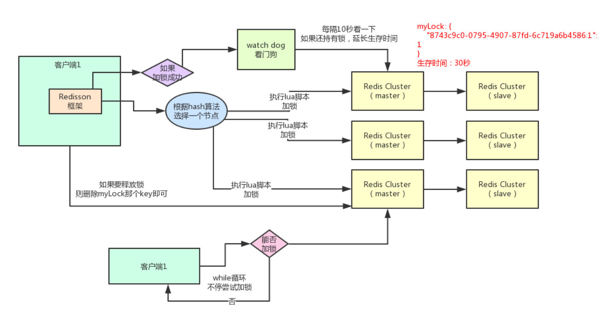
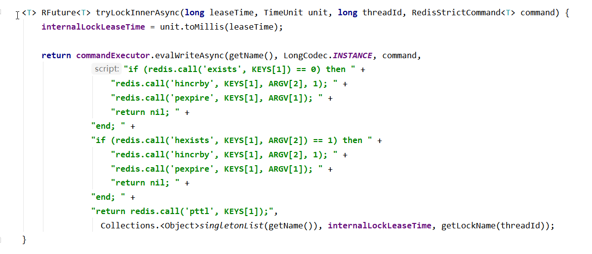
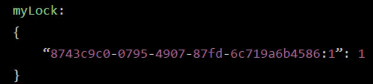
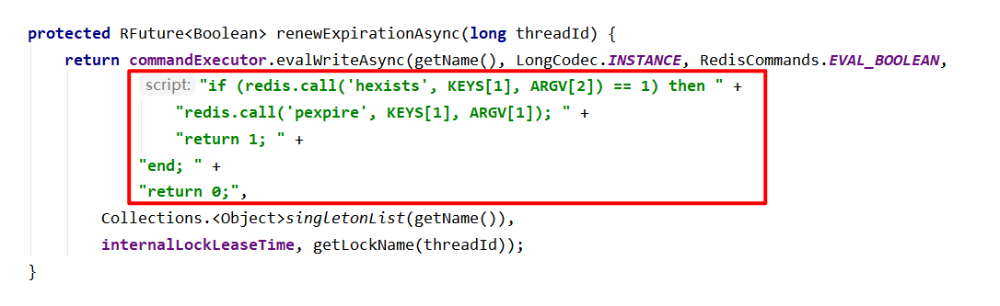
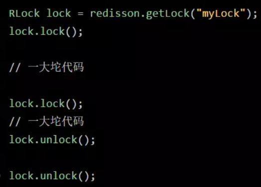
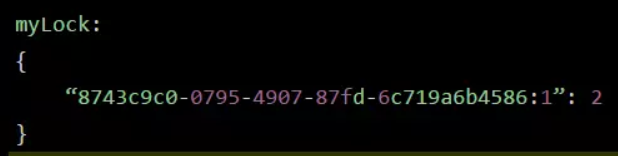
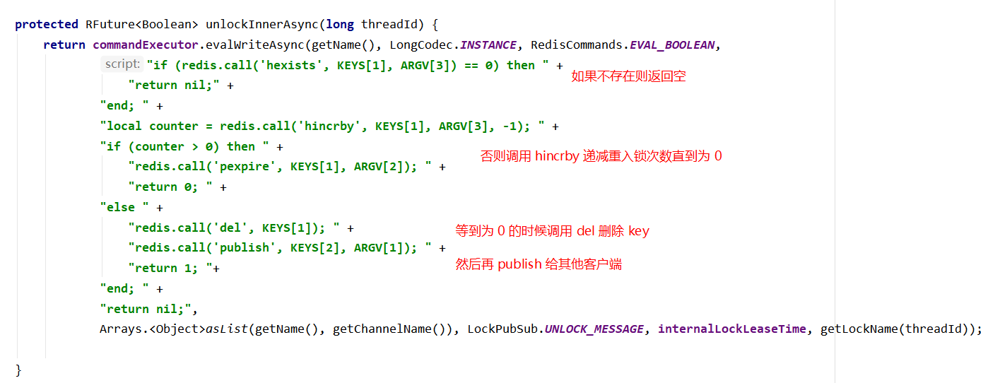

## 常见的分布式锁实现方案

首先，在了解分布式锁具体实现方案之前，我们应该先思考一下使用分布式锁必须要考虑的一些问题。

### 使用分布式锁需要考虑哪些问题：

1. 互斥性：在任意时刻，只能有一个进程持有锁。
2. 防死锁：即使有一个进程在持有锁的期间崩溃而未能主动释放锁，要有其他方式去释放锁从而保证其他进程能获取到锁。
3. 加锁和解锁的必须是同一个进程。
4. 锁的续期问题。

### 常见的分布式锁实现方案主要分为以下三种：

1. 基于数据库的分布式锁
2. 基于缓存的分布式锁（主要是 Redis）
3. 基于 Zookeeper 的分布式锁（临时有序节点）

这里主要采用第二种方案，也就是基于 Redis 的分布式锁实现方案。

### 使用 Redis 实现分布式锁的主要步骤：

1. 指定一个 key 作为锁标记，存入 Redis 中，指定一个 **<font color="#de2c58">唯一的用户标识</font>** 作为 value。
2. 当 key 不存在时才能设置值，确保同一时间只有一个客户端进程获得锁，满足 **<font color="#de2c58">互斥性</font>** 特性。
3. 设置一个过期时间，防止因系统异常导致没能删除这个 key，满足 **<font color="#de2c58">防死锁</font>** 特性。
4. 当处理完业务之后需要清除这个 key 来释放锁，清除 key 时需要校验 value 值，需要满足 **<font color="#de2c58">只有加锁的人才能释放锁</font>** 。

### 使用 Redisson 实现分布式锁

Redisson是【Redis 官方推荐】官网推荐分布式锁实现的方案。使用起来也很简单。

#### Redisson 实现分布式锁原理图



下面从加锁机制、锁互斥机制、Watch dog 自动延时机制、可重入加锁机制、锁释放机制、方案缺陷等六个方面对 Redisson 实现分布式锁的底层原理进行分析。

#### 1.加锁原理

某个客户端进程要加锁，如果该客户端面对的是一个 RedisCluster 集群，他首先会根据 hash 节点选择一台机器。这里注意，仅仅只是选择一台机器！这点很关键！紧接着，就会发送一段 lua 脚本到
Redis 上，那段 lua 脚本如下所示：



这里 KEYS[1] 参数代表的是你加锁的 key，比如说：```RLock lock = redisson.getLock("myLock");```     这里你自己设置了加锁的那个锁 key 就是 “myLock”。ARGV[1] 代表的就是锁 key 的默认生存时间，默认 30 秒。ARGV[2] 代表的是加锁的客户端的 ID，类似于下面这样：8743c9c0-0795-4907-87fd-6c719a6b4586:1

上面这一段加锁的 lua 脚本的作用是：第一段 if 判断语句，就是用 “exists myLock” 命令判断一下，如果你要加锁的那个锁 key 不存在的话，你就进行加锁。如何加锁呢？很简单，用下面的命令：```hset myLock 8743c9c0-0795-4907-87fd-6c719a6b4586:1 1```，通过这个命令设置一个 hash 数据结构，这行命令执行后，会出现一个类似下面的数据结构：



上述就代表 “8743c9c0-0795-4907-87fd-6c719a6b4586:1” 这个客户端对 “myLock” 这个锁 key 完成了加锁。接着会执行 ```pexpire myLock 30000``` 命令，设置 myLock 这个锁 key 的生存时间是 30 秒。到此为止，加锁完成。

#### 2.锁互斥机制

那么在这个时候，如果客户端 2 来尝试加锁，执行了同样的一段 lua 脚本，会咋样呢？很简单，第一个 if 判断会执行 ```exists myLock```，发现 myLock这个锁 key 已经存在了。
接着第二个 if 判断，判断一下，myLock 锁 key 的 hash 数据结构中，是否包含客户端 2 的 ID，但是明显不是的，因为那里包含的是客户端 1 的 ID。所以，客户端 2 会获取到 pttl myLock 返回的一个数字，这个数字代表了myLock 这个锁 key 的剩余生存时间。比如还剩 15000 毫秒的生存时间。此时客户端 2 会进入一个 while 循环，不停的尝试加锁。

#### 3.锁的续期机制

客户端 1 加锁的锁 key 默认生存时间才 30 秒，如果超过了 30 秒，客户端 1 还想一直持有这把锁，怎么办呢？简单！只要客
户端 1 一旦加锁成功，就会启动一个 watch dog。


他是一个后台定时任务线程，获取锁成功之后，会将持有锁的线程放入到一个 ```EXPIRATION_RENEWAL_MAP```里面，然后每隔 10 秒（internalLockLeaseTime / 3）检查一下，如果客户端 1 还持有锁 key（判断客户端是否还持有 key，其实就是从 EXPIRATION_RENEWAL_MAP 里面去出线程 id 然后根据线程 id 去 Redis 中查，如果存在就会延长 key 的时间），那么就会不断的延长锁 key 的生存时间。




#### 4.可重入加锁机制

那如果客户端 1 都已经持有了这把锁了，结果可重入的加锁会怎么样呢？比如下面这种代码：



这时我们来分析一下上面那段 lua 脚本。第一个 if 判断肯定不成立，“exists myLock” 会显示锁 key 已经存在了。第二个 if判断会成立，因为 myLock 的 hash 数据结构中包含的那个 ID，就是客户端 1 的那个 ID，也就是 “8743c9c0-0795-4907-87fd-6c719a6b4586:1” 此时就会执行可重入加锁的逻辑，他会用：```incrby myLock 8743c9c0-0795-4907-87fd-6c71a6b4586:1 1```，通过这个命令，对客户端 1 的加锁次数，累加 1。此时 myLock 数据结构变为下面这样：



大家看到了吧，那个 myLock 的 hash 数据结构中的那个客户端 ID，就对应着加锁的次数

#### 5.释放锁机制

如果执行 ```lock.unlock()```，就可以释放分布式锁，此时的业务逻辑也是非常简单的，主要包括三步：



1. 对 myLock 数据结构中的那个加锁次数减 1。如果发现加锁次数是 0 了，说明这个客户端已经不再持有锁了，此时就会用：```del myLock``` 命令，从 Redis 里删除这个 key。

2. 广播释放锁的消息，通知阻塞等待的线程或进程资源可用。（通过 lua 脚本向通道名为 ```redisson_lock__channel``` publish 一条 ```UNLOCK_MESSAGE``` 信息）

3. 取消 Watch dog 机制，将 RedissonLock.EXPIRATION_RENEWAL_MAP 里面的线程 id 删除，并且 cancel 定时任务。

#### 6.此方案的优缺点

##### 优点

通过 Redisson 实现分布式可重入锁，比原生的 ```SET mylock userId NX PX milliseconds``` + lua 实现的效果更好些，虽然基本原理都一样，但是它帮我们屏蔽了内部的执行细节，不需要我们再去手写获取锁和释放锁的逻辑，直接调用它的 lock 和 unlock 方法即可，而且通过分析源码可知，RedissonLock 是可重入的，并且考虑了失败重试，可以设置锁的最大等待时间， 在其他等待申请锁资源的进程等待申请锁的实现上也做了一些优化，减少了无效的锁申请，提升了资源的利用率。

##### 缺点

其实 Redisson 实现分布式锁方案最大的问题，就是如果你对某个 redis master 实例，写入了 myLock 这种锁 key 的 value，此时 master 会异步复制给其对应的 slave 实例。但是这个过程中一旦发生 master 宕机，主备切换，slave 变为了 master。接着就会导致，客户端 2 来尝试加锁的时候，在新的 master 上完成了加锁，而客户端 1 也以为自己成功加了锁。此时就会导致多个客户端对一个分布式锁完成了加锁。这时系统在业务语义上一定会出现问题，导致各种脏数据的产生。所以这个就是 redis cluster，或者是 redis master-slave 架构的主从异步复制导致的 redis 分布式锁的最大缺陷：在 redis master 实例宕机的时候，可能导致多个客户端同时完成加锁。
