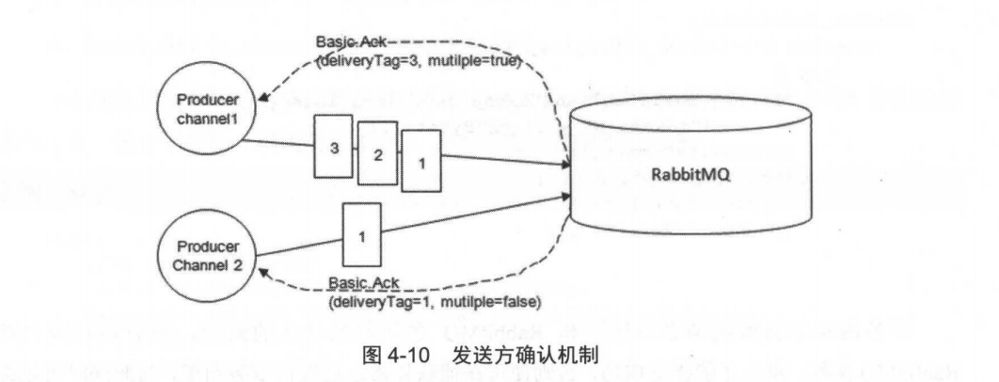
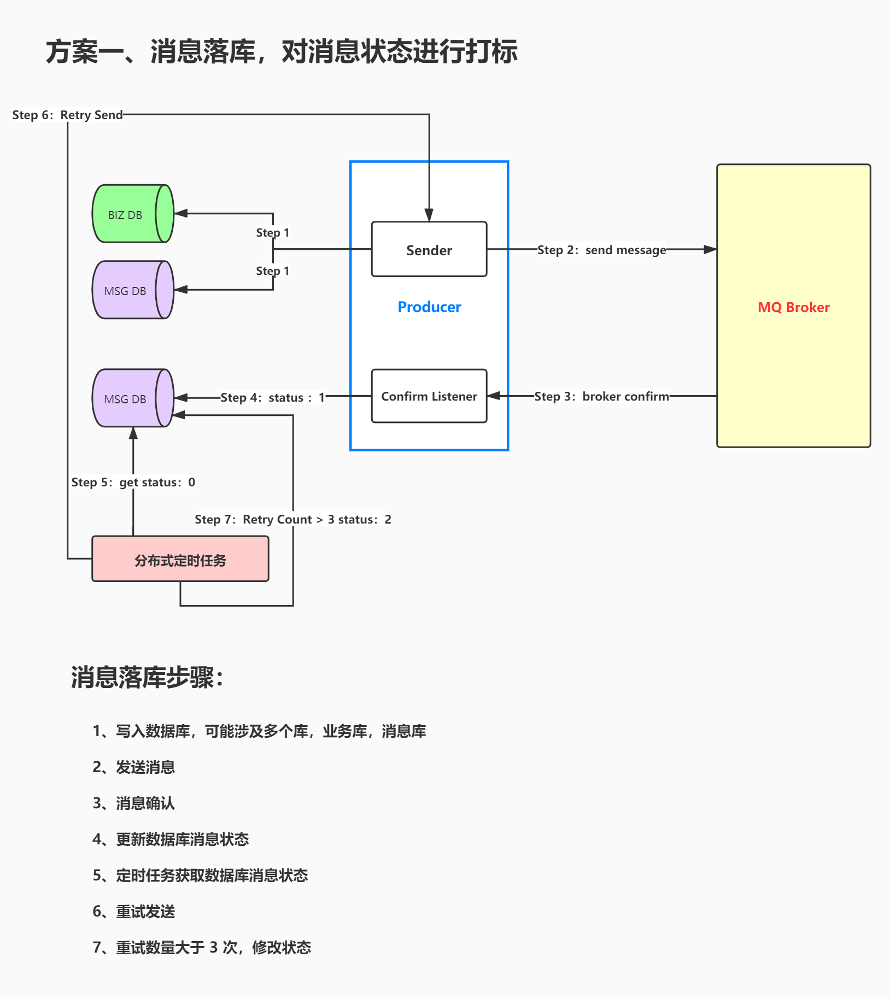

## RabbitMQ 消息 100% 可靠性投递的解决方案

### 该方案利用到了 RabbitMQ 的发送方确认（publish confirm） 机制：
生产者将信道设置成 confirm（确认）模式，一旦信道进入 confirm 模式，所有在信道上面发布的消息都会被指派一个唯一的 ID（从 1 开始），一旦消息被投递到所有匹配的队列之后，RabbitMQ 就会发送一个确认（Basic.Ack）给生产者（包含消息的唯一 ID），这就使得生产者知晓消息已经正确到达了目的地了。如果消息和队列是持久化的，那么确认消息会在写入磁盘之后发出。RabbitMQ 回传给生产者的确认消息中的 deliveryTag 包含了确认消息的序号，此外 RabbitMQ 也可以设置 channel.basicAck 方法中的 multiple 参数，表示到这个序号之前的所有消息都已经得到了处理。可以参考图 4-10 。注意辨别这里的确认和消费时候的确认之前的异同。

### 方案设计图

- Step 1： 首先把业务数据落盘，紧接着，我们再把这个消息记录也进行落盘（尽量保证在同一个数据源）。

- Step 2：发送消息到 Broker（采用 Confirm 方式发送）

- Step 3、4：生产者端接受 Broker 节点返回的 Confirm 确认消息结果，然后进行更新消息记录表里的消息状态。比如默认 Status = 0（发送中） 当收到消息确认成功后，更新为 1（成功） 即可！

- Step 5：但是在 Producer 发送消息的过程中可能可能出现各种异常，比如：Producer 发送消息到 Broker 的过程中因为网络闪断消息丢失了，此时，Producer 永远不会收到 Broker 的 ack 或 nack，这个时候就需要 Producer 对消息进行可靠性投递了，保障消息不丢失。还有一种情况，比如：Broker 确实收到了 Producer 发送的消息并且消费方也已经成功消费了这条消息，但是 Broker 返回给 Producer 的 ack 消息因为某种原因丢失了，导致 Producer 的 msg 的 status 一直处于发送中，当定时任务重新发送的时候，消费端可能会出现消息被重复消费，此时消费端就要进行消息的幂等处理了。

- Step 6：接下来我们把中间状态的消息进行重新投递 retry send，继续发送消息到MQ ，当然也可能有多种原因导致发送失败

- Step 7：我们可以采用设置最大努力尝试次数，比如投递了 3 次，还是失败，那么我们可以将最终状态设置为Status = 2 ，最后 交由人工解决处理此类问题（或者把消息转储到失败表中）。

#### 代码测试

- 1、将 test.sql 导入本地数据库，将服务端和消费端的 RabbitMQ 配置文件账号密码进行相应的修改
- 2、首先启动消费服务端 `rabbitmq-customer`服务的`Application.java`

- 3、再启动 rabbitmq 服务端 `rabbitmq-publisher`服务的`Application.java`
- 4、浏览器调用投递信息的控制器 `127.0.0.1:8081/generateOrder`
- 5、在消费服务端的控制台可以看到信息处理的日志